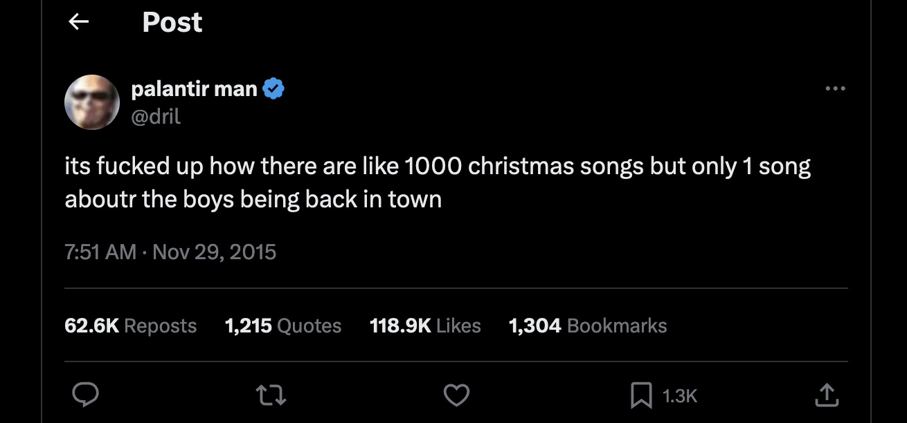
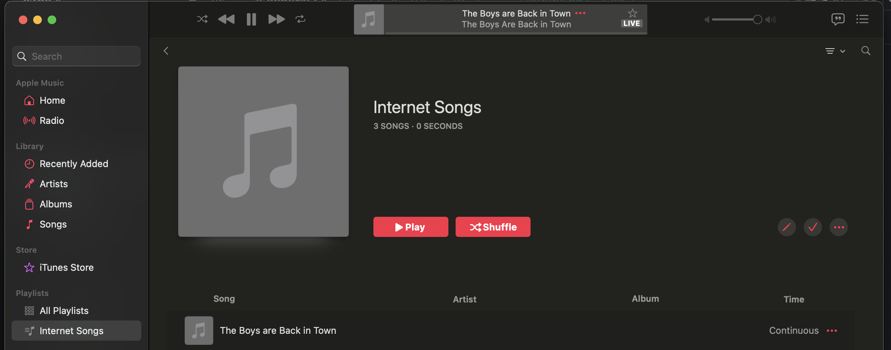

# Now the Boys can always be Back in Town



_(https://x.com/dril/status/670963270317154304)_



## Getting it goin'

First compile any tools (litestream and lockrun). Note that litestream was last updated circa 2012 and it might build noisily.

``` shell
bin/setup
```

Then (probably needs to be run as root), get setup to run via cron:

``` shell
bin/install
```

This will create a /var/run directory for lockrun to use, and will then provide some /etc/crontab lines to add.

## References

 - https://github.com/rick/litestream
 - http://unixwiz.net/tools/lockrun.html
 - https://en.wikipedia.org/wiki/Thin_Lizzy

## Note:

This does not include the boys. Boys sold separately. Put your own boys in theboys/arebackintown.mp3
