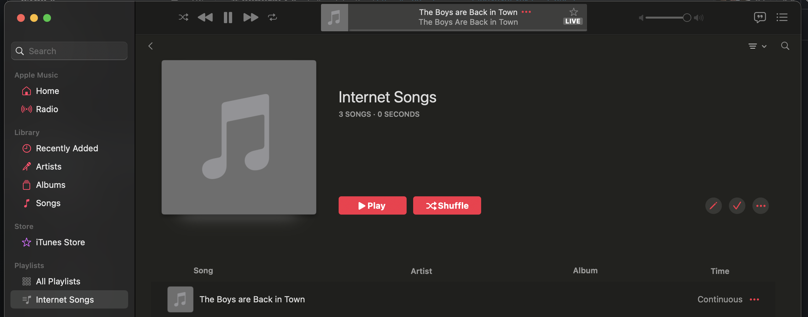

# may thy boys always be back in town


_(https://x.com/dril/status/670963270317154304)_

----


_(https://tinnies.club/@rick/112723240050962092)_

----



## Getting it goin'

First compile any tools (litestream and lockrun). Note that litestream was last updated circa 2012 and it might build noisily.

``` shell
bin/setup
```

Then (probably needs to be run as root), get setup to run via cron:

``` shell
bin/install
```

This will create a /var/run directory for lockrun to use, and will then provide some /etc/crontab lines to add.

## nginx proxy snippet

We can use nginx to proxy the stream, with SSL:

```
  location /stream/ {
    #Configure proxy to pass data to upstream service
    proxy_pass http://theboysarebackin.town:8000/;
    #HTTP version 1.1 is needed for sockets
    proxy_http_version 1.1;
    proxy_set_header Host $host;
    proxy_set_header Referer $http_referer;
    proxy_set_header X-Real-IP $remote_addr;
    proxy_set_header X-Forwarded-For $proxy_add_x_forwarded_for;
    proxy_set_header X-Forwarded-Proto  $scheme;
    proxy_set_header X-NginX-Proxy true;
    proxy_read_timeout 86400;
    proxy_connect_timeout 86400;
    proxy_send_timeout 86400;
    send_timeout 86400;
  }
```

## References

 - https://github.com/rick/litestream
 - http://unixwiz.net/tools/lockrun.html
 - https://en.wikipedia.org/wiki/Thin_Lizzy

## Note:

This does not include the boys. Boys sold separately. Put your own boys in theboys/arebackintown.mp3
